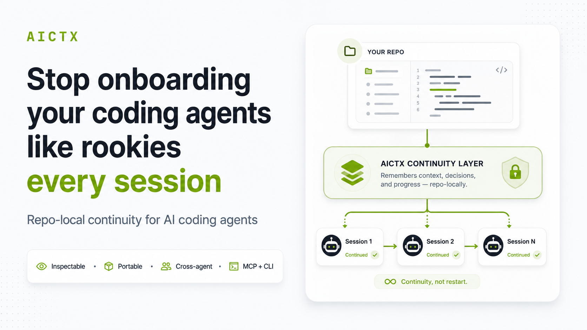
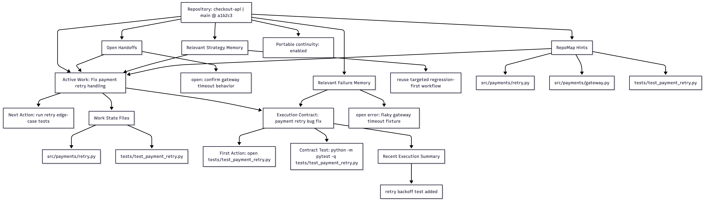

# AICTX

[](https://pypi.org/project/aictx/)
[](https://github.com/oldskultxo/aictx/actions/workflows/ci.yml)
[](LICENSE)
[](https://pypi.org/project/aictx/)
[](https://pepy.tech/projects/aictx)
[](https://aictx.org)

**Stop onboarding your coding agent from scratch every session.**

AICTX is a repo-local continuity layer for Codex, Claude Code, GitHub Copilot and other AI coding agents. It records what actually happened in the repository — active work, next actions, decisions, failures, validation evidence and useful context — so the next agent session can continue instead of rediscovering everything.

```bash
pip install aictx
aictx install
aictx init
```

[Quickstart](docs/QUICK-START.md) · [Website](https://aictx.org) · [Star this repo](https://github.com/oldskultxo/aictx)



---

## The problem

AI coding agents are powerful, but most sessions still start cold:

- they scan the same README, docs, Makefile and source tree;
- they rediscover decisions that were already made;
- they repeat failed commands or stale assumptions;
- unfinished work depends on one provider's chat history.

AICTX turns that fragile chat-local memory into repo-local, inspectable operational continuity.

## What AICTX does

AICTX adds a small lifecycle around agent work:

```text
resume useful context -> do the work -> finalize evidence -> next session continues
```

That continuity is stored locally under `.aictx/` and exposed through CLI commands, local MCP tools/resources/prompts and generated agent instructions.

It is useful when:

| Use case | Why it matters |
|---|---|
| **Solo development** | Resume interrupted work without rebuilding context from scratch. |
| **Teams** | Keep operational handoffs in the repo instead of private chat history. |
| **Agent switching** | Let Codex finalize work that Claude Code, GitHub Copilot or another compatible agent can resume. |

## Try it in 60 seconds

Install and initialize once:

```bash
pip install aictx
aictx install
aictx init
```

Start work with a resume capsule:

```bash
aictx resume --repo . --task "fix the parser bug" --json
```

After the agent works, close the loop with factual evidence:

```bash
aictx finalize --repo . \
  --status success \
  --summary "Fixed parser recovery and validated parser tests" \
  --json
```

A later session can resume from the saved repo-local state instead of relying on hidden chat history.

Example final summary:

```text
AICTX summary
Context: resumed parser recovery work from prior state.
Saved: updated handoff and continuity state.
Validation: pytest -q tests/test_parser.py passed.
Next: expand malformed-token coverage.
```

## Why developers star this repo

- **Local-first:** continuity lives in the repository under `.aictx/`, not in a cloud memory service.
- **Inspectable:** handoffs, decisions, Work State, failure memory and continuity views are reviewable artifacts.
- **Agent-neutral:** works with Codex-first flows, Claude Code, GitHub Copilot and generic CLI/MCP-compatible agents.
- **MCP + CLI:** agents can use local MCP tools when available and fall back to deterministic CLI commands.
- **Trust-aware:** AICTX records evidence and limitations; it does not claim automatic correctness or productivity gains.

AICTX was also an [Open-Launch Top 1 Daily Winner](https://open-launch.com/projects/aictx/).

## See the result

Inspect current repo continuity at any time:

```bash
aictx view --repo .
```

Default output:

```text
.aictx/reports/continuity-view.md
.aictx/reports/continuity-map.mmd
```

Not hidden memory. Reviewable operational continuity with quality signals for stale, missing, demoted or unverified context.



[Continuity View documentation](docs/CONTINUITY_VIEW.md) · [Image asset](https://raw.githubusercontent.com/oldskultxo/aictx/main/docs/images/continuity-view.png)

## What AICTX preserves

AICTX focuses on operational facts that help the next agent continue useful work:

- active Work State and next action;
- execution summaries and handoffs;
- explicit decisions;
- known failures and resolved failure patterns;
- strategy hints from successful prior work;
- discarded hypotheses / abandoned approaches when agents explicitly record a pivot;
- execution contracts, guard triggers and validation expectations;
- optional RepoMap structural entry points;
- continuity quality signals;
- optional Git-portable continuity for small teams.

## What AICTX is not

AICTX is not an autonomous coding agent, a cloud memory service, a vector database, a dashboard, a replacement for human review, or a guarantee of correctness, productivity gains or token savings.

It is a repo-local operational continuity layer used by cooperating coding agents.

## Core capabilities

| Capability | What it does |
|---|---|
| **Resume capsule** | Compiles repo-local continuity into one compact agent brief. |
| **Work State** | Preserves active task, hypothesis, files, next action, risks and verification state. |
| **Finalize / Execution Summary** | Records what actually happened at the end of work. |
| **Handoffs / Decisions** | Keeps operational summaries and explicit project decisions across sessions. |
| **Failure Memory** | Helps agents avoid repeating known failed commands or error paths. |
| **Strategy Memory** | Suggests successful prior approaches when they are relevant. |
| **MCP + CLI** | Exposes the same repo-local continuity through local MCP tools and CLI fallback. |
| **Continuity View** | Renders inspectable Markdown/Mermaid reports of current continuity. |

## Supported agents

AICTX is runner-aware, not runner-locked.

- **Codex-first:** `AGENTS.md`, optional global Codex setup, CLI/runtime JSON contract, MCP support and Codex integration files.
- **Claude-aware:** `CLAUDE.md`, `.claude/settings.json`, hooks, MCP support and Claude Code integration files.
- **GitHub Copilot:** best-effort instruction hardening through `.github/copilot-instructions.md`, `.github/instructions/aictx.instructions.md`, optional prompt files and VS Code MCP config when supported.
- **Generic fallback:** any agent that can read repo instructions, run CLI commands, consume JSON/Markdown, or connect to a local MCP server.

## Documentation

Start here:

- [Installation](docs/INSTALLATION.md)
- [Quickstart](docs/QUICK-START.md)
- [Technical overview](docs/TECHNICAL_OVERVIEW.md)

Core concepts:

- [AI coding agent memory](docs/concepts/ai-coding-agent-memory.md)
- [Repo-local continuity](docs/concepts/repo-local-memory.md)
- [Operational continuity](docs/concepts/operational-memory.md)
- [Work State](docs/WORK_STATE.md)
- [RepoMap](docs/REPOMAP.md)
- [Failure Memory](docs/FAILURE_MEMORY.md)
- [Strategy Memory](docs/STRATEGY_MEMORY.md)
- [Handoffs and Decisions](docs/HANDOFFS.md)
- [Execution Summary](docs/EXECUTION_SUMMARY.md)
- [Execution Contracts and Compliance](docs/EXECUTION_CONTRACTS.md)
- [Doctor diagnostics](docs/DOCTOR.md)

Use cases and comparisons:

- [Shared continuity across coding agents](docs/use-cases/shared-continuity-across-agents.md)
- [Codex operational continuity](docs/use-cases/codex-memory.md)
- [Claude Code operational continuity](docs/use-cases/claude-code-memory.md)
- [GitHub Copilot operational continuity](docs/use-cases/github-copilot-memory.md)
- [Comparing coding-agent continuity approaches](docs/compare/coding-agent-continuity-approaches.md)
- [AICTX vs AGENTS.md](docs/compare/aictx-vs-agents-md.md)
- [AICTX vs long context](docs/compare/aictx-vs-long-context.md)
- [AICTX vs vector databases](docs/compare/aictx-vs-vector-database.md)
- [AICTX vs chat history](docs/compare/aictx-vs-chat-history.md)

Operations and trust:

- [Usage](docs/USAGE.md)
- [MCP](docs/MCP.md)
- [Cleanup](docs/CLEANUP.md)
- [Safety](docs/SAFETY.md)
- [Limitations](docs/LIMITATIONS.md)
- [Changelog](CHANGELOG.md)
- [Upgrade](docs/UPGRADE.md)
- [Release checklist](docs/RELEASE_CHECKLIST.md)
- [Contributing](CONTRIBUTING.md)

## Project links

- **Website:** https://aictx.org
- **PyPI package:** https://pypi.org/project/aictx/
- **CLI:** `aictx`
- **Official project identity:** [docs/OFFICIAL_PROJECT.md](docs/OFFICIAL_PROJECT.md)
