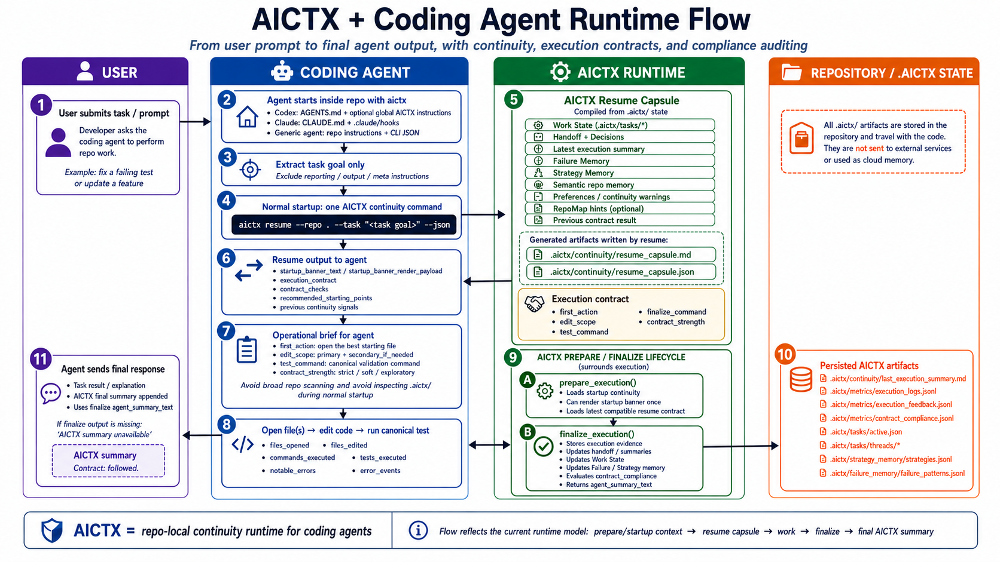

# AICTX

[](https://pypi.org/project/aictx/)
[](https://pypi.org/project/aictx/)
[](LICENSE)

**Repo-local continuity runtime for coding agents.**

AICTX lets a coding agent start the next session from the operational state left by previous work: active task state, next action, known failures, decisions, execution evidence, structural repo hints, and branch-safe Work State.

Install it once, initialize the repo, then keep using your coding agent normally.

AICTX is **Codex-first**, **Claude-aware**, and **generic-agent compatible**.

Current documented implementation: `6.1.0`



---

## Product promise

AICTX gives coding agents a small, repo-local memory loop:

```text
resume useful context -> do the work -> finalize factual evidence -> help the next session
```

It is for developers who repeatedly use coding agents in the same repository and want less cold-start rediscovery, explicit next actions, remembered failures, reusable successful strategies, and inspectable local artifacts instead of hidden cloud memory.

It is not a generic token compressor, autonomous coding system, hosted agent platform, or correctness guarantee.

---

## See it in 30 seconds

Without AICTX, the next agent session usually starts cold:

```text
User: continue parser work
Agent: scans repo, opens README, searches files, rediscovers tests...
```

With AICTX, the agent can start from a fresh resume capsule:

```bash
aictx resume --repo . --task "continue parser work" --json
```

Example shape:

```text
Resuming: parser edge cases
Last progress: BLOCKED status added
Next: expand tests/test_parser.py
Known failure: pytest unavailable outside .venv
Suggested command: .venv/bin/python -m pytest -q
```

The exact fields depend on what previous sessions actually recorded. AICTX does not invent missing facts.

---

## Demo result

In a two-session coding task, AICTX helped the second session resume from the intended work surface instead of rediscovering the repo.

| Session 2 metric | Without AICTX | With AICTX |
|---|---:|---:|
| Files explored | 10 | 5 |
| Files edited | 3 | 1 |
| Commands run | 15 | 8 |
| Exploration before first edit | 15 | 6 |
| Time to complete | 1'59'' | 1'12'' |
| First relevant file | `README.md` | `tests/test_parser.py` |

This is not a universal benchmark. It is an observable continuity demo.
See [Demo](docs/DEMO.md).

---

## Why this exists

Coding agents are powerful, but most sessions still start cold.

They rediscover repository structure, repeat failed paths, lose track of what was already verified, and depend on chat history for unfinished work.

AICTX makes that continuity repo-local, inspectable, and reusable.

---

## Install

From inside the repository:

```bash
pip install aictx
aictx install
aictx init
aictx --version
```

After that, keep using your coding agent.

The generated repo instructions and hooks guide supported agents to call AICTX automatically. The normal user experience is:

```text
install -> init -> use your coding agent
```

See [Installation](docs/INSTALLATION.md) and [Quickstart](docs/QUICKSTART.md).

---

## How it works

At normal task startup, supported agents use one continuity query:

```bash
aictx resume --repo . --task "<task goal>" --json
```

`--task` should contain only the work goal. `--task` is the only normal resume input in v6; legacy `--request` startup input has been removed.

After work, supported agents finalize factual evidence:

```bash
aictx finalize --repo . --status success|failure --summary "<what happened>" --json
```

In JSON mode, `resume` also includes bounded `loaded_context` metadata that explains why failures, handoffs, decisions, strategies, and RepoMap hints were selected. It is additive inspection/debugging metadata, not proof of correctness and not hidden agent reasoning.

The runtime loop is:

```text
resume capsule -> work -> finalize evidence -> next resume
```

Technical integrations can also use wrapped/internal execution surfaces. See [Technical overview](docs/TECHNICAL_OVERVIEW.md) and [Usage](docs/USAGE.md).

---

## Core capabilities

| Capability | What it does | Why it matters |
|---|---|---|
| **Work State** | Preserves active task, hypothesis, files, next action, risks, and verification state | The next session knows what was in progress |
| **Failure Memory** | Stores observed command/test/build/type/lint failures as structured patterns | Agents can avoid repeating known mistakes |
| **RepoMap** | Optional Tree-sitter structural map of files and symbols | Agents get better “where should I look first?” context |
| **Strategy Memory** | Reuses successful prior execution patterns | Known-good approaches can be suggested again |
| **Handoff / Decisions** | Keeps operational summaries and explicit project decisions | Architecture and intent survive session boundaries |
| **Execution Summary** | Captures what happened at finalize time | The next session starts from factual continuity |
| **Resume capsule** | Compiles continuity into one agent brief | Agents do not need to discover AICTX internals at startup |

---

## How AICTX handles stale context

AICTX does not inject one permanent memory dump into every session.

Each task gets a fresh resume capsule built from repo-local artifacts: Work State, latest execution summary, decisions, known failures, strategy hints, and optional RepoMap data.

Old context is treated as context, not truth:

- Work State is branch-safe.
- Failures and strategies are observed evidence, not absolute instructions.
- Resume capsules are regenerated per task.
- Dedupe and staleness metadata help keep continuity bounded.
- Missing or unsafe context is skipped, warned about, or marked `not_evaluated` rather than invented.

See [Limitations](docs/LIMITATIONS.md) and [Technical overview](docs/TECHNICAL_OVERVIEW.md).

---

## Supported agents

AICTX is runner-aware, not runner-locked.

- **Codex-first:** `AGENTS.md`, optional global Codex setup, CLI/runtime JSON contract.
- **Claude-aware:** `CLAUDE.md`, `.claude/settings.json`, `.claude/hooks/aictx_*.py`.
- **Generic fallback:** any agent that can read repo instructions, run CLI commands, and consume JSON/Markdown.

---

## What AICTX is not

AICTX is not:

- a hosted agent platform;
- a dashboard or task manager;
- a vector database;
- hidden cloud memory;
- an autonomous repo repair system;
- a sandbox or enforcement layer;
- a guarantee of productivity, token savings, speedups, or correctness.

---

## Artifact contract

The stable repo-local continuity artifact contract in `6.1.0` is:

```text
.aictx/continuity/session.json
.aictx/continuity/handoff.json
.aictx/continuity/decisions.jsonl
.aictx/continuity/semantic_repo.json
.aictx/continuity/dedupe_report.json
.aictx/continuity/staleness.json
.aictx/continuity/continuity_metrics.json
.aictx/strategy_memory/strategies.jsonl
.aictx/failure_memory/failure_patterns.jsonl
.aictx/metrics/execution_logs.jsonl
.aictx/metrics/execution_feedback.jsonl
.aictx/tasks/active.json
.aictx/tasks/threads/*
```

Optional or latest-run artifacts may also appear:

```text
.aictx/continuity/handoffs.jsonl
.aictx/continuity/last_execution_summary.md
.aictx/continuity/resume_capsule.md
.aictx/continuity/resume_capsule.json
.aictx/area_memory/areas.json
.aictx/repo_map/config.json
.aictx/repo_map/manifest.json
.aictx/repo_map/index.json
.aictx/repo_map/status.json
```

For lifecycle details, startup banner semantics, branch-safe loading rules, internal runtime commands, and compliance auditing, see [Technical overview](docs/TECHNICAL_OVERVIEW.md).

---

## Documentation

Start here:

- [Installation](docs/INSTALLATION.md)
- [Quickstart](docs/QUICKSTART.md)
- [Demo](docs/DEMO.md)
- [Technical overview](docs/TECHNICAL_OVERVIEW.md)

Core concepts:

- [Work State](docs/WORK_STATE.md)
- [RepoMap](docs/REPOMAP.md)
- [Failure Memory](docs/FAILURE_MEMORY.md)
- [Strategy Memory](docs/STRATEGY_MEMORY.md)
- [Handoffs and Decisions](docs/HANDOFFS.md)
- [Execution Summary](docs/EXECUTION_SUMMARY.md)
- [Execution Contracts and Compliance](docs/EXECUTION_CONTRACTS.md)

Operations and trust:

- [Usage](docs/USAGE.md)
- [Cleanup](docs/CLEANUP.md)
- [Safety](docs/SAFETY.md)
- [Limitations](docs/LIMITATIONS.md)
- [Upgrade](docs/UPGRADE.md)
- [Release checklist](docs/RELEASE_CHECKLIST.md)
- [Contributing](CONTRIBUTING.md)

---

## Current limits

AICTX improves continuity only when agents or integrations cooperate with the runtime contract. File access, commands, tests, and failures are strongest when passed explicitly or captured through wrapped execution.

AICTX does not claim measured productivity gains, guaranteed speedups, or automatic correctness.

It makes continuity visible, inspectable, and reusable.
