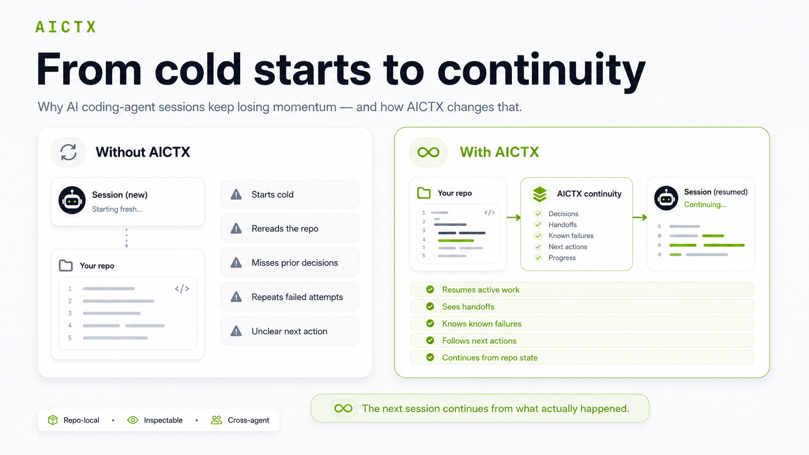
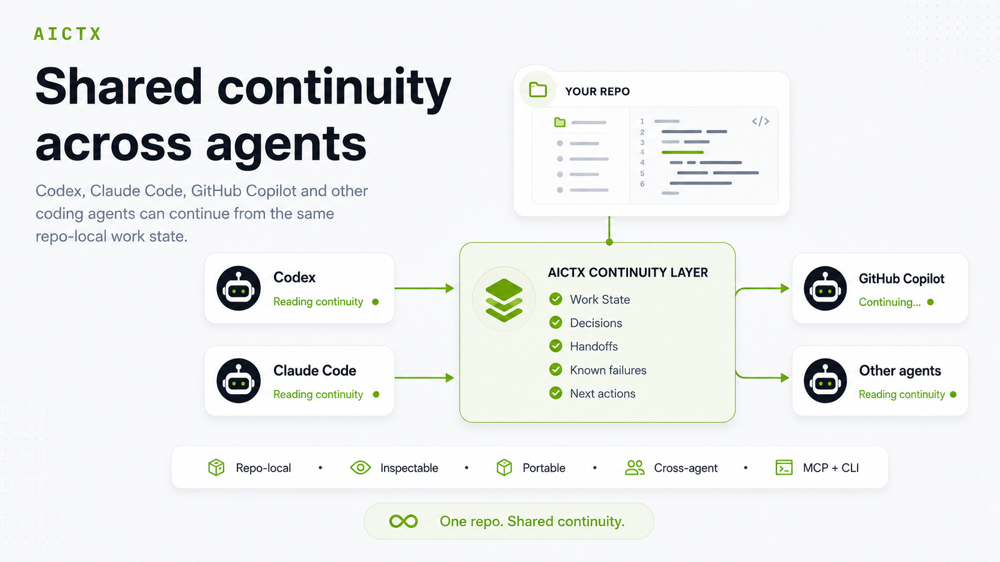

# AICTX

[](https://pypi.org/project/aictx/)
[](https://aictx.org)
[](https://pypi.org/project/aictx/)
[](https://github.com/oldskultxo/aictx/actions/workflows/ci.yml)
[](LICENSE)
[](https://pepy.tech/projects/aictx)
[](https://open-launch.com/projects/aictx/)

**Operational continuity for AI coding agents.**

AICTX helps Codex, Claude Code, GitHub Copilot and other coding agents continue across sessions from repo-local execution state: active work, next actions, decisions, failures, validation evidence and useful repo context.

The next session does not start from zero. It resumes from what actually happened.

It also makes continuity shared across agents. Codex can finalize work into `.aictx/`, then Claude Code, GitHub Copilot, or another compatible agent can resume from the same repo-local facts instead of relying on one provider's chat history.

**Website:** https://aictx.org  
**PyPI package:** https://pypi.org/project/aictx/  
**CLI:** `aictx`


It is a repo-local CLI/runtime layer for agent continuity. It stores inspectable artifacts under `.aictx/` and exposes continuity through CLI commands, local MCP tools/resources/prompts, and generated agent instructions.

AICTX is **Codex-first**, **GitHub Copilot-aware**, **Claude-aware**, and **generic-agent compatible**.


[Quickstart](docs/QUICK-START.md) · [Installation](docs/INSTALLATION.md) · [Continuity View](docs/CONTINUITY_VIEW.md) · [Demo](docs/DEMO.md) · [Technical overview](docs/TECHNICAL_OVERVIEW.md) · [Official project](docs/OFFICIAL_PROJECT.md)

---

## The problem

Coding agents are powerful, but most sessions still start cold:

- they rediscover the same repository structure;
- they reopen broad docs before the relevant source or test;
- they repeat failed commands or stale assumptions;
- unfinished work depends on chat history instead of repo-local state.

AICTX makes that continuity repo-local, inspectable, and reusable.



## Install

Install AICTX, then initialize the repository:

```bash
pip install aictx
aictx install
aictx init
aictx --version
```

If `~/.codex/` already exists, `aictx install` detects Codex and installs/updates AICTX-managed global Codex integration by default. Interactive installs ask for confirmation; `aictx install --yes` applies the detected setup automatically.

After that, keep using your coding agent.

The generated repo instructions and hooks tell supported agents to use AICTX. When a runner cannot attach MCP tools, the CLI fallback remains available. The normal user experience is:

```text
install -> init -> use your coding agent
```

See [Installation](docs/INSTALLATION.md) and [Quickstart](docs/QUICK-START.md).

---

## The operational continuity loop

```text
resume useful context -> do the work -> finalize evidence -> next session continues
```

AICTX stores continuity locally under `.aictx/`, so it is inspectable, reviewable and not dependent on hidden chat history.

That continuity is agent-neutral:

```text
Codex finalize -> .aictx continuity -> Claude/Copilot/other agent resume
```



This is useful when a team or solo developer alternates between coding agents. The repo carries the operational handoff: what was tried, what failed, what passed, what remains, and where the next agent should start.

Start lifecycle work with `aictx resume --task "..."` and close it with `aictx finalize`. For on-demand task planning outside the startup lifecycle, AICTX can also compile a bounded read-only Task Context Pack:

```bash
aictx prepare "fix the parser bug" --repo . --json
```

`prepare` is not a replacement for `resume` / `finalize`; use `resume` to start lifecycle work, and use `prepare` only for focused read-only context outside that startup path.

## MCP server

AICTX can expose repo-local continuity as local MCP tools, resources and prompts.

Compatible agents can launch:

```bash
aictx mcp-server --repo . --profile full
```

The default `aictx install` / `aictx init` flow prepares AICTX MCP runtime metadata and repo-local MCP config through AICTX-managed, reversible setup. Sensitive client config is written as a managed `<AICTX>` block where the format supports comments, and as AICTX-managed JSON metadata in `.mcp.json` / `.vscode/mcp.json`. `aictx clean` / `aictx uninstall` remove only those managed entries and preserve user-authored MCP servers. Agents should prefer MCP tools when available and fall back to CLI commands otherwise.

See [MCP](docs/MCP.md), [Continuity Guard](docs/CONTINUITY_GUARD.md), and [Steer Guard](docs/STEER_GUARD.md).


## Agent integration files

AICTX also ships generated integration files for Claude Code and Codex.

These integrations are MCP-first and CLI-fallback: compatible agents should call AICTX MCP tools such as `aictx_resume`, `aictx_finalize`, and `aictx_view`; when MCP is unavailable they fall back to the AICTX CLI.

See [Agent integrations](docs/PLUGINS.md).

## What changes?

### Without operational continuity

```text
A new agent session starts cold.
It scans README, docs, Makefile and source files.
It rediscovers decisions.
It may repeat failed commands.
It asks for context that already existed.
```

### With AICTX

```text
The agent runs one resume command.
It sees active work, next action, known failures and validation path.
After work, it finalizes factual evidence for the next session.
```

AICTX turns disconnected agent sessions into a continuous operational workflow, even when the next session uses a different coding agent.

## Inspect the continuity

```bash
aictx view --repo .
```

AICTX can render the current operational state of a repository as local Markdown and Mermaid:

```text
.aictx/reports/continuity-view.md
.aictx/reports/continuity-map.mmd
```

Not hidden memory. Reviewable operational continuity, with quality signals for stale, missing, demoted, or unverified context.


[Continuity View documentation](docs/CONTINUITY_VIEW.md) · [Image asset](https://raw.githubusercontent.com/oldskultxo/aictx/main/docs/images/continuity-view.png)

## What AICTX preserves

AICTX focuses on operational facts that help the next agent continue useful work:

- active Work State and next action;
- execution summaries and handoffs;
- explicit decisions;
- known failures and resolved failure patterns;
- strategy hints from successful prior work, including compact rationale when available;
- compact discarded hypotheses / abandoned approaches when agents explicitly record a pivot;
- execution contracts and contract-compliance signals;
- optional RepoMap structural entry points;
- continuity quality signals for stale, missing, demoted, obsolete, or unverified context;
- read-only Task Context Packs for focused task-specific context;
- lifecycle diagnostics for incomplete or unfinalized sessions;
- optional Git-portable continuity for small teams.

## What AICTX is not

AICTX is not an autonomous coding agent, a cloud memory service, a vector database, a dashboard, a replacement for human review, or a guarantee of correctness, productivity gains or token savings.

It is a repo-local operational continuity layer used by cooperating coding agents.

---

## Core capabilities

AICTX has a small core loop and several optional continuity layers.

### Core loop

| Capability | What it does |
|---|---|
| **Resume capsule** | Compiles repo-local continuity into one compact agent brief |
| **Work State** | Preserves active task, hypothesis, files, next action, risks and verification state |
| **Finalize / Execution Summary** | Records what actually happened at the end of work |
| **Handoffs / Decisions** | Keeps operational summaries and explicit project decisions across sessions |

### Continuity layers

| Capability | What it adds |
|---|---|
| **Failure Memory** | Helps agents avoid repeating known failed commands or error paths |
| **Strategy Memory** | Suggests successful prior approaches when they are relevant |
| **RepoMap** | Provides optional structural entry points from files and symbols |
| **Execution Contracts** | Records expected first action, edit scope and validation path |
| **Continuity Guard / Steer Guard** | Gives lightweight boundary checks before risky actions or user redirections |
| **MCP + CLI** | Exposes the same repo-local continuity through local MCP tools and CLI fallback |
| **Continuity View** | Renders inspectable Markdown/Mermaid reports of current continuity |

---

## Supported agents

AICTX is runner-aware, not runner-locked.

- **Codex-first:** `AGENTS.md`, optional global Codex setup, CLI/runtime JSON contract, MCP support, and Codex integration files.
- **Claude-aware:** `CLAUDE.md`, `.claude/settings.json`, hooks, MCP support, and Claude Code integration files.
- **GitHub Copilot:** best-effort instruction hardening through `.github/copilot-instructions.md`, `.github/instructions/aictx.instructions.md`, optional prompt files, and VS Code MCP config when supported.
- **Generic fallback:** any agent that can read repo instructions, run CLI commands, consume JSON/Markdown, or connect to a local MCP server.

---

## Documentation

Start here:

- [Installation](docs/INSTALLATION.md)
- [Quickstart](docs/QUICK-START.md)
- [Demo](docs/DEMO.md)
- [Technical overview](docs/TECHNICAL_OVERVIEW.md)

Core concepts:

- [AI coding agent memory](docs/concepts/ai-coding-agent-memory.md)
- [Repo-local continuity](docs/concepts/repo-local-memory.md)
- [Operational continuity](docs/concepts/operational-memory.md)
- [Failure memory for coding agents](docs/concepts/failure-memory-for-coding-agents.md)
- [Work State](docs/WORK_STATE.md)
- [RepoMap](docs/REPOMAP.md)
- [Failure Memory](docs/FAILURE_MEMORY.md)
- [Strategy Memory](docs/STRATEGY_MEMORY.md)
- [Handoffs and Decisions](docs/HANDOFFS.md)
- [Execution Summary](docs/EXECUTION_SUMMARY.md)
- [Execution Contracts and Compliance](docs/EXECUTION_CONTRACTS.md)
- [Doctor diagnostics](docs/DOCTOR.md)

Use cases and comparisons:

- [Shared continuity across coding agents](docs/use-cases/shared-continuity-across-agents.md)
- [Codex operational continuity](docs/use-cases/codex-memory.md)
- [Claude Code operational continuity](docs/use-cases/claude-code-memory.md)
- [GitHub Copilot operational continuity](docs/use-cases/github-copilot-memory.md)
- [Comparing coding-agent continuity approaches](docs/compare/coding-agent-continuity-approaches.md)
- [AICTX vs AGENTS.md](docs/compare/aictx-vs-agents-md.md)
- [AICTX vs long context](docs/compare/aictx-vs-long-context.md)
- [AICTX vs vector databases](docs/compare/aictx-vs-vector-database.md)
- [AICTX vs chat history](docs/compare/aictx-vs-chat-history.md)

Operations and trust:

- [Usage](docs/USAGE.md)
- [Cleanup](docs/CLEANUP.md)
- [Safety](docs/SAFETY.md)
- [Limitations](docs/LIMITATIONS.md)
- [Upgrade](docs/UPGRADE.md)
- [Release checklist](docs/RELEASE_CHECKLIST.md)
- [Contributing](CONTRIBUTING.md)

---

## Current limits

AICTX improves continuity only when agents or integrations cooperate with the runtime contract. File access, commands, tests, and failures are strongest when passed explicitly or captured through wrapped execution.

AICTX does not claim measured productivity gains, guaranteed speedups, or automatic correctness.

It makes operational continuity visible, inspectable, and reusable.

## AICTX 6.11 agent lifecycle hardening

AICTX 6.11 makes the continuity loop harder to skip and less noisy in large repositories.

It adds:

- `runner_contract`: compact metadata telling supported agents that AICTX is required, MCP is preferred, CLI fallback is mandatory, and the core tools should be verified once per session.
- `guard_triggers`: stable action boundaries for first edit, scope changes, risky commands, user steering, and final answers.
- `execution_contract.validation_policy`: task-type-aware validation expectations so code tasks require focused evidence while documentation and analysis tasks stay advisory.
- `--brief`: a smaller resume payload for routine agent startup.
- attributed handoffs: `agent_id`, `adapter_id`, `session_id`, and `evidence_quality`.
- git-state awareness at finalize: staged, unstaged and untracked edited files can be surfaced as non-blocking continuity gaps.
- dead-end capture: compact discarded hypotheses can be preserved when an agent explicitly records an abandoned approach or receives a clear correction.
- strategy rationale: selected successful strategies can include why they worked, when to reuse them, and when to avoid them.

Supported integrations are instructed to prefer MCP tools and fall back to CLI commands. AICTX still depends on agent/runner cooperation and does not guarantee that every agent will follow the lifecycle perfectly.
