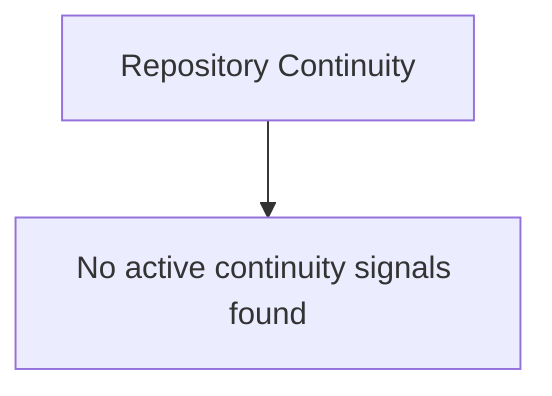

# Continuity View

AICTX Continuity View renders the current operational continuity of a repository as local Markdown and Mermaid. It helps users and coding agents inspect active Work State, handoffs, failures, execution contracts, execution summaries, RepoMap hints, working-tree changes, and portable continuity status without starting from scratch.

Short claim:

```text
AICTX makes repo continuity inspectable.
```

Technical claim:

```text
Generate a local, deterministic Mermaid map of active coding-agent continuity.
```

Continuity View shows the current operational continuity of the repository, not just the latest run.


[Open the image asset](https://aictx.org/images/continuity-view.png) · [Open the raw GitHub image](https://raw.githubusercontent.com/oldskultxo/aictx/main/docs/images/continuity-view.png)

---

## Why it exists

AICTX already stores useful continuity across sessions: Work State, handoffs, decisions, failures, strategies, execution summaries, execution contracts, area memory, and optional RepoMap hints.

That evidence can be distributed across several repo-local artifacts and runtime outputs. Continuity View gives users and agents one stable place to inspect the current operational state:

```text
.aictx/reports/continuity-view.md
.aictx/reports/continuity-map.mmd
```

Use it when you want to answer:

```text
What continuity exists now in this repo so the next coding agent does not start cold?
```

It is not a generic graph viewer, dashboard, knowledge base, or replacement for `resume`. It is a deterministic continuity report generated from existing AICTX state.

---

## Generate the view

From an initialized repository:

```bash
aictx view --repo .
```

Default output:

```text
AICTX Continuity View generated.

Markdown view:
.aictx/reports/continuity-view.md

Mermaid map:
.aictx/reports/continuity-map.mmd
```

The Markdown view embeds the Mermaid diagram and then lists the same continuity groups as readable sections.

---

## Generate Mermaid only

```bash
aictx view --repo . --mermaid
```

This prints Mermaid only, without Markdown fences, and updates:

```text
.aictx/reports/continuity-map.mmd
```

Use this when you want to paste the diagram into a Mermaid renderer or inspect the graph output directly.

---

## JSON output

```bash
aictx view --repo . --json
```

Example shape:

```json
{
  "ok": true,
  "view": {
    "markdown_path": ".aictx/reports/continuity-view.md",
    "mermaid_path": ".aictx/reports/continuity-map.mmd",
    "generated_at": "2026-05-17T19:23:37Z"
  },
  "summary": {
    "active_work_state": false,
    "changed_files": 11,
    "open_handoffs": 3,
    "relevant_failures": 1,
    "strategies": 3,
    "area_memory": 5,
    "execution_contracts": 1,
    "execution_summaries": 3,
    "repomap_hints": 5,
    "portable_continuity": "local-only"
  }
}
```

`active_work_state` is true only when an actual active Work State is loaded. Paused or blocked carryover can still appear in the view as `Paused Work` or `Blocked Work`, but it is not reported as the current active task.

---

## Custom Markdown output

```bash
aictx view --repo . --output custom-continuity-view.md
```

This writes the Markdown view to the requested path and keeps the Mermaid map at the default stable path unless a future map-output option is used.

---

## Include the view after finalize

A finalized session can leave behind an inspectable Continuity View for the next agent:

```bash
aictx finalize --repo . --status success --summary "targeted tests passed" --include-view --json
```

`--include-view` runs normal finalization, generates or updates the Continuity View, and adds stable links to the final summary. It does not insert the full diagram into the summary by default.

The final AICTX summary can include both the local `.mmd` link and a `mermaid.live` online view link generated from the deterministic Mermaid payload:

```text
Continuity view file: [continuity-map.mmd](.aictx/reports/continuity-map.mmd)
View continuity online: [mermaid.live view](https://mermaid.live/view#pako:...)
```

Agents should preserve those links when appending the AICTX final summary to their user-facing response. They should not replace the URL with a placeholder, manually reconstruct the pako URL, or draw their own Mermaid diagram.

---

## Resume integration

`aictx resume --json` reports whether the latest Continuity View exists:

```json
{
  "continuity_view": {
    "exists": true,
    "markdown_path": ".aictx/reports/continuity-view.md",
    "mermaid_path": ".aictx/reports/continuity-map.mmd",
    "generated_at": "2026-05-17T19:23:37Z"
  }
}
```

If no view exists yet, `resume` reports the expected paths and does not regenerate the view automatically.

---

## What the view contains

The generated Markdown includes:

- repository metadata;
- overview with active task, next action, risk, changed files, last execution, handoffs, failures, execution contract, and portability status;
- embedded Mermaid Continuity Map;
- working-tree changes;
- active, paused, or blocked Work State details;
- open handoffs;
- relevant failure memory;
- strategy memory;
- area memory;
- latest compatible execution contract;
- recent execution summaries;
- RepoMap hints;
- portable continuity status;
- notes for the next agent.

The Mermaid map uses bounded groups and stable node order. It is meant to show continuity that is active or relevant, not every historical memory row.

---

## Who generates the Mermaid diagram?

AICTX generates the Mermaid diagram deterministically from repo-local continuity artifacts.

The coding agent may trigger generation with:

```bash
aictx view
aictx finalize --include-view
```

but it does not author the graph manually.

Canonical rule:

```text
The agent triggers it. AICTX generates it. Mermaid is deterministic.
```

This preserves reproducibility, factuality, auditability, and Git-reviewable output.

Agents should not invent nodes, omit relevant failures manually, draw Mermaid in final summaries, or use unpersisted chat context as the graph source.

---

## Data sources

Continuity View builds one normalized model from repo-local facts, then renders both Markdown and Mermaid from that same model.

Sources can include:

| Source | How it appears |
|---|---|
| Working tree | Changed-file count and bounded changed-file list |
| Work State | Active, paused, or blocked work, next action, risk, files, validation commands |
| Execution contract | Latest compatible contract, first action, canonical test command |
| Execution summaries | Recent finalization summaries |
| Handoffs | Open or active handoffs and next steps |
| Failure Memory | Relevant unresolved or recent failure patterns |
| Strategy Memory | Reusable prior execution strategies |
| Area Memory | Repo areas with execution/failure/strategy signal |
| RepoMap | Optional structural path and symbol hints |
| Portability state | Portable continuity status and mode |

---

## Active task semantics

Continuity View separates an actual active task from carryover work:

- `Active task` in the Overview means AICTX loaded an active Work State.
- A recent paused or blocked Work State may still appear as `Paused Work` or `Blocked Work` in the map and Work State section.
- Paused/blocked carryover is operationally useful, but it is not labeled as the current active task.

This distinction keeps the Overview accurate while still making unresolved continuity visible.

---

## Empty or partial continuity

The command is safe in repositories with partial data. If no operational signal exists, AICTX still writes a valid view with a small Mermaid graph:



Missing RepoMap, failure memory, handoffs, or Work State are rendered as unavailable or `None` instead of failing the command.

---

## Review and portability

The default stable paths live under `.aictx/reports/`:

```text
.aictx/reports/continuity-view.md
.aictx/reports/continuity-map.mmd
```

Whether those files are local-only or Git-portable follows the repository's AICTX portability policy and ignore configuration. The files are plain text, so they can be reviewed, linked, archived, or copied into issue/PR discussions when appropriate.

---

## Related docs

- [Usage](USAGE.md)
- [Technical overview](TECHNICAL_OVERVIEW.md)
- [Work State](WORK_STATE.md)
- [Execution Contracts](EXECUTION_CONTRACTS.md)
- [Execution Summary](EXECUTION_SUMMARY.md)
- [RepoMap](REPOMAP.md)
- [Git-portable continuity](PORTABILITY.md)
